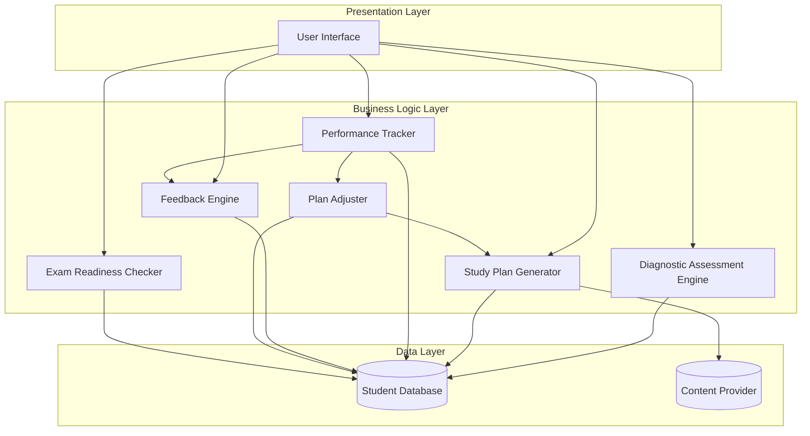

# Design Document: AI-Powered Personalized Learning Platform

## Overview

The AI-powered personalized learning platform is designed as a modular system that adapts to individual student needs through continuous assessment and feedback loops. The architecture separates concerns into distinct components: assessment, plan generation, performance tracking, feedback generation, and plan adjustment. This design enables the system to function as a virtual study mentor that guides students toward exam success through data-driven personalization.

The platform operates on a cycle: assess → plan → execute → track → feedback → adjust. Each component is designed to be independently testable and maintainable while working together to create a cohesive learning experience.

## Architecture

The system follows a layered architecture with clear separation between data, business logic, and presentation layers:

### Component Responsibilities

- **Diagnostic Assessment Engine**: Evaluates student knowledge and categorizes strengths/weaknesses
- **Study Plan Generator**: Creates personalized schedules based on assessment results and time constraints
- **Performance Tracker**: Records and maintains history of all learning activities
- **Feedback Engine**: Analyzes performance and generates actionable improvement suggestions
- **Plan Adjuster**: Modifies study plans based on ongoing performance data
- **Exam Readiness Checker**: Evaluates overall preparedness and provides readiness metrics
- **Content Provider**: Supplies learning act